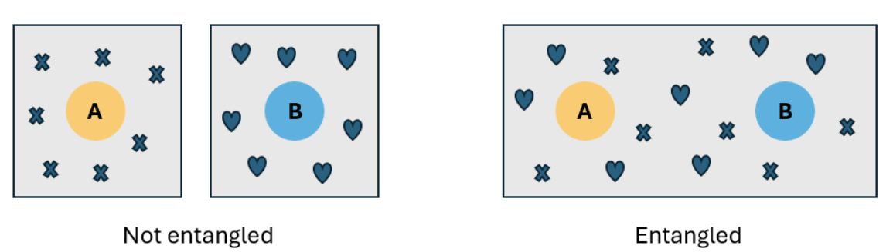

Imagine that you have two qubits, A and B. The qubits are independent from each other, which means that the information about the state of qubit A, whatever it is, belongs only to qubit A. Similarly the information about the state of qubit B belongs to qubit B. You can describe the state of each qubit. In this case, the qubits are not entangled, because they aren't sharing any information.

Now imagine that you entangle the qubits (you'll learn how to do this later). If qubits A and B are entangled, then the information about the state of qubit A
is not independent of the state of qubit B. When entangled, information is shared between both qubits, and there's no way to infer the state of qubit A or state of qubit B. You can only describe the state of the global system, not the state of the individual qubits.

Entanglement is a quantum correlation between two or more particles. If two particles are entangled, they can't be described independently, but only as a whole system.

---

### **1. Independent Qubits (Not Entangled)**

- Each qubit (**A** and **B**) has its **own separate state** (like |0⟩, |1⟩, or a superposition).
- The state of **A** doesn’t affect **B**, and vice versa.
- You can fully describe **A** and **B** individually.
- Example:
  - Qubit **A** = |0⟩
  - Qubit **B** = |1⟩
  - Total system = **A** ⊗ **B** (just a combination of the two).

### **2. Entangled Qubits (Dependent on Each Other)**

- The qubits **share information**—their states are now **linked**.
- You **cannot** describe **A** or **B** alone—only the **whole system** (e.g., "A and B together are in state X").
- Measuring one qubit **instantly affects** the other, no matter how far apart they are.
- Example (Bell state, a type of entanglement):
  - System state = **|00⟩ + |11⟩** (A and B are either both |0⟩ or both |1⟩, but you don’t know which until you measure one).
  - If you measure **A** and get |0⟩, **B** instantly becomes |0⟩ too (and same for |1⟩).

### **Key Point**

- Entanglement means **no qubit "owns" its state anymore**—only the **pair (or group) does**.
- This is why quantum teleportation works: you **transfer the shared state**, not the physical qubit.
